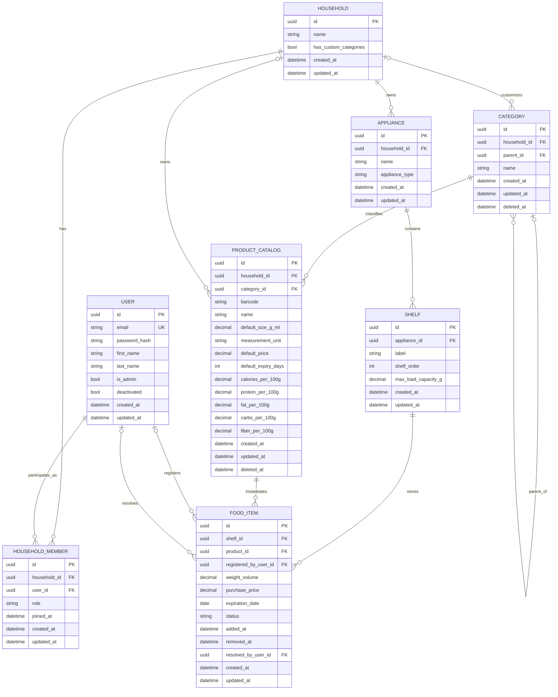

```mermaid
erDiagram
    USER {
        uuid id PK
        string email UK
        string password_hash
        string first_name
        string last_name
        bool is_admin
        bool deactivated
        datetime created_at
        datetime updated_at
    }

    HOUSEHOLD {
        uuid id PK
        string name
        bool has_custom_categories
        datetime created_at
        datetime updated_at
    }

    HOUSEHOLD_MEMBER {
        uuid id PK
        uuid household_id FK
        uuid user_id FK
        string role
        datetime joined_at
        datetime created_at
        datetime updated_at
    }

    APPLIANCE {
        uuid id PK
        uuid household_id FK
        string name
        string appliance_type
        datetime created_at
        datetime updated_at
    }

    SHELF {
        uuid id PK
        uuid appliance_id FK
        string label
        int shelf_order
        decimal max_load_capacity_g
        datetime created_at
        datetime updated_at
    }

    CATEGORY {
        uuid id PK
        uuid household_id FK
        uuid parent_id FK
        string name
        datetime created_at
        datetime updated_at
        datetime deleted_at
    }

    PRODUCT_CATALOG {
        uuid id PK
        uuid household_id FK
        uuid category_id FK
        string barcode
        string name
        decimal default_size_g_ml
        string measurement_unit
        decimal default_price
        int default_expiry_days
        decimal calories_per_100g
        decimal protein_per_100g
        decimal fat_per_100g
        decimal carbs_per_100g
        decimal fiber_per_100g
        datetime created_at
        datetime updated_at
        datetime deleted_at
    }

    FOOD_ITEM {
        uuid id PK
        uuid shelf_id FK
        uuid product_id FK
        uuid registered_by_user_id FK
        decimal weight_volume
        decimal purchase_price
        date expiration_date
        string status
        datetime added_at
        datetime removed_at
        uuid resolved_by_user_id FK
        datetime created_at
        datetime updated_at
    }

    HOUSEHOLD ||--o{ HOUSEHOLD_MEMBER : has
    USER ||--o{ HOUSEHOLD_MEMBER : participates_as
    HOUSEHOLD ||--o{ APPLIANCE : owns
    APPLIANCE ||--o{ SHELF : contains

    HOUSEHOLD |o--o{ CATEGORY : customizes
    CATEGORY |o--o{ CATEGORY : parent_of
    CATEGORY ||--o{ PRODUCT_CATALOG : classifies
    HOUSEHOLD |o--o{ PRODUCT_CATALOG : owns

    SHELF ||--o{ FOOD_ITEM : stores
    PRODUCT_CATALOG ||--o{ FOOD_ITEM : instantiates
    USER |o--o{ FOOD_ITEM : registers
    USER |o--o{ FOOD_ITEM : resolves
```
